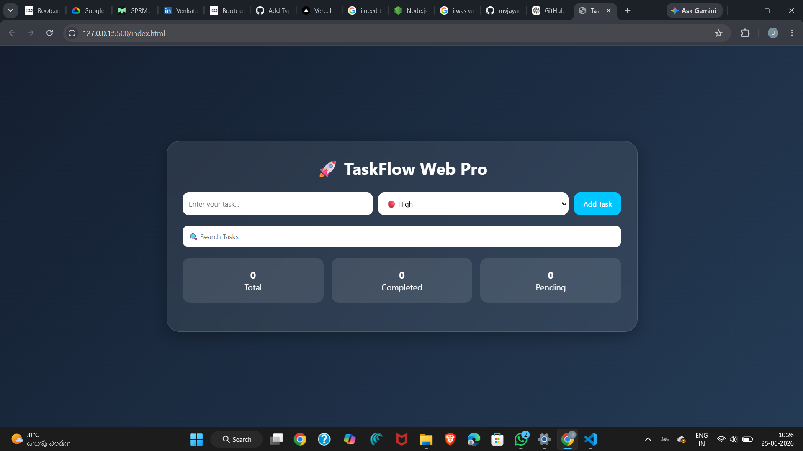
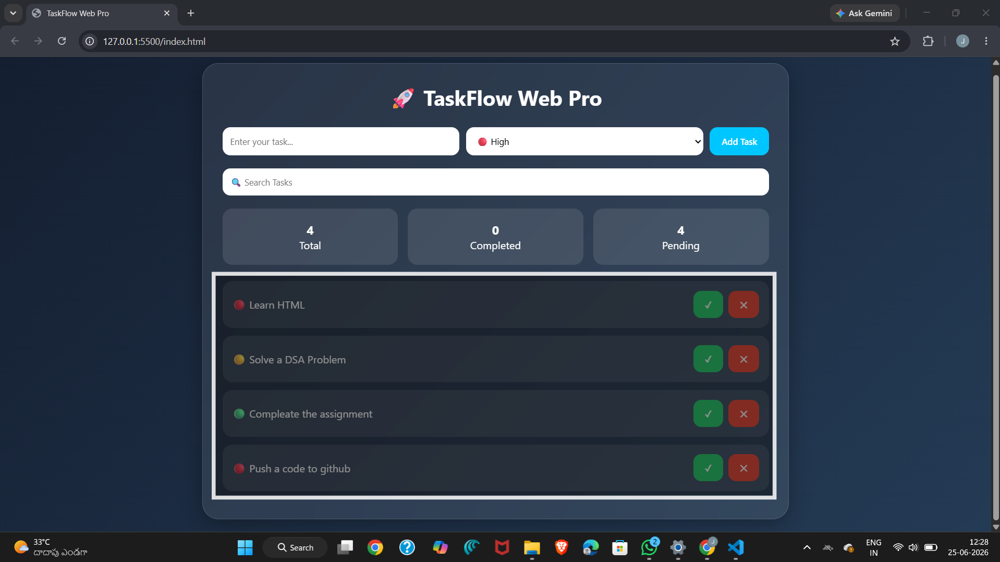
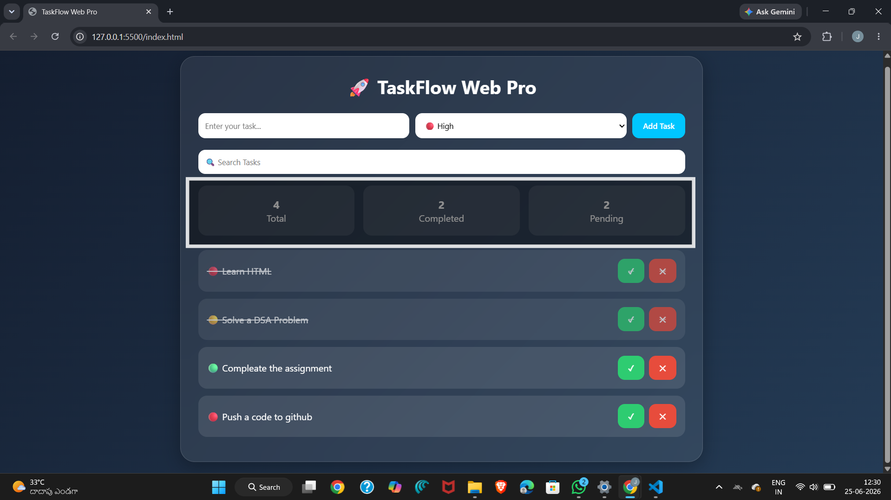
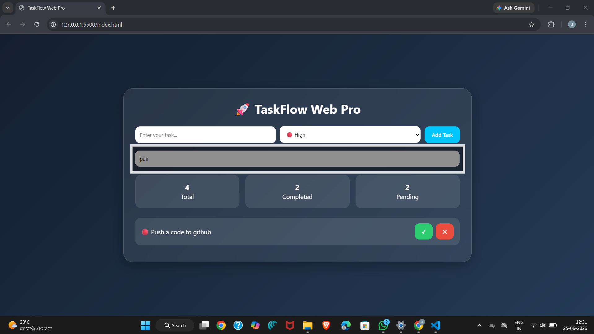

# 🚀 TaskFlow Web Pro

A modern and responsive Task Management Web Application built using HTML, CSS, and JavaScript.

TaskFlow Web Pro helps users organize daily tasks efficiently with features like priority management, task completion tracking, statistics dashboard, search functionality, and local storage support.

---

## 🌐 Check Out the Site

<p align="center">
  <a href="https://todo-task-flow-web.vercel.app/">
    
  </a>
</p>


## ✨ Features

### 📋 Task Management
- Add Tasks
- Delete Tasks
- Complete Tasks

### 🎯 Priority Levels
- 🔴 High Priority
- 🟡 Medium Priority
- 🟢 Low Priority

### 🔍 Search Functionality
- Search tasks instantly

### 📊 Statistics Dashboard
- Total Tasks
- Completed Tasks
- Pending Tasks

### 💾 Local Storage
- Tasks remain saved even after refreshing the browser

### 🎨 Modern UI
- Glassmorphism Design
- Responsive Layout
- Smooth User Experience

---

## 🛠 Technologies Used

| Technology | Purpose |
|------------|----------|
| HTML5 | Structure |
| CSS3 | Styling |
| JavaScript | Functionality |
| Local Storage | Data Persistence |
| Git & GitHub | Version Control |

---

## 📂 Project Structure

```text
TaskFlow-Web
│
├── index.html
├── style.css
├── script.js
├── README.md
│
└── screenshots
```

---

## 📸 Screenshots

### Home Page



### Task Management



### Statistics Dashboard



### Search Functionality



---

## ▶️ How To Run

1. Download or Clone the Repository

```bash
git clone <https://github.com/mvjayadeep16/Todo_TaskFlow_web.git>
```

2. Open the Project Folder

3. Open `index.html` in a browser

OR

Use Live Server in VS Code.

---

## 🎓 Concepts Practiced

- HTML
- CSS
- JavaScript
- DOM Manipulation
- Local Storage
- Event Handling
- Responsive Design
- Git & GitHub

---

## 🚀 Future Improvements

- Dark / Light Theme Toggle
- Due Dates
- Task Categories
- Notifications
- Progress Tracking
- Backend Integration
- User Authentication

---

## 📫 Connect With Me

<p align="center">
  <a href="mailto:mvjayadeep16@gmail.com">
    
  </a>

  <a href="www.linkedin.com/in/venkata-jayadeep-maddipatla-b1a111385">
    
  </a>

  <a href="https://www.instagram.com/jayadeep_455/">
    
  </a>
</p>

---

## 👨‍💻 Author

**Venkata Jayadeep Maddipatla**

B.Tech Computer Science and Engineering

SRM Institute of Science and Technology (SRMIST)

---

⭐ If you found this project useful, consider giving it a star on GitHub.
